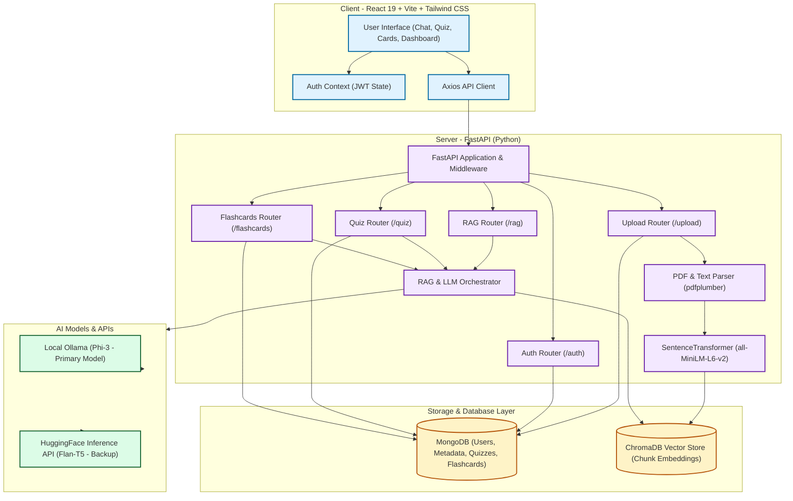

# AI Study Buddy RAG 🎓

Welcome to **AI Study Buddy RAG**, a modern, full-stack, AI-powered study assistant application designed to optimize learning through **Retrieval-Augmented Generation (RAG)**. Users can upload their textbooks, lecture notes, or study materials (in PDF/TXT format) and instantly interact with them. 

The application automatically indexes materials, provides a direct Q&A chat (complete with page-level source references), generates custom multiple-choice quizzes, and builds active-recall flashcard sets with practice-performance analytics.

---

## 🏗️ System Architecture

Below is the conceptual architecture of the system, illustrating how the frontend client, FastAPI server, databases, and AI components interact:



---

## 🌟 Core Features

1. **User Authentication & Session Management**:
   - Secure register/login flow.
   - JWT token generation (stored in `localStorage` in frontend, validated via FastAPI security dependencies in backend).
2. **Dynamic Study Material Ingestion**:
   - Accepts `.pdf` and `.txt` uploads (up to 50MB).
   - Asynchronous background tasking handles file processing to ensure a smooth UI.
3. **Retrieval-Augmented Chat (RAG)**:
   - Chat directly with your uploaded notes.
   - AI answers questions using only document context and displays clickable **sources and page references**.
4. **Interactive Quiz Generator**:
   - Generates multiple-choice questions (MCQs) of varying difficulty levels (`easy`, `medium`, `hard`).
   - Automatically computes final score, provides correct answers, and lists reasoning/page references for each question.
5. **Active-Recall Flashcards**:
   - Generates study terms and concepts into flashcard decks.
   - Tracks review sessions, confidence scores, and outputs dashboard statistics (reviewed count, mastered count, confidence averages).

---

## 🛠️ Technological Stack

| Component | Technology | Description |
| :--- | :--- | :--- |
| **Frontend** | React 19, Vite, Tailwind CSS v4 | High-performance, responsive UI with smooth transitions and active-recall states. |
| **Backend** | FastAPI (Python 3.10), Uvicorn | High-concurrency Python API gateway, leveraging asynchronous background tasks. |
| **Core Database** | MongoDB (PyMongo) | Stores user records, note upload statuses, quiz logs, and flashcard review entries. |
| **Vector DB** | ChromaDB | High-performance local vector database storing document chunk embeddings. |
| **Embeddings Model**| SentenceTransformers (`all-MiniLM-L6-v2`) | Generates semantic 384-dimensional dense vectors for chunks and queries. |
| **LLM Engine** | Ollama (Local `phi3:latest`) | Zero-cost, privacy-focused local LLM model execution. |
| **Fallback LLM** | HuggingFace Inference API (`google/flan-t5-base`) | Cloud backup if local Ollama service is offline. |

---

## ⚙️ Core Pipelines: How It Works

### 1. Document Ingestion Pipeline
```
[File Upload] ──> [Extract Text (pdfplumber)] ──> [Create Text Chunks (Size: 500, Overlap: 50)]
                                                              │
                                                              ▼
[ChromaDB Collection] <── [Index & Store] <── [Encode Embeddings (SentenceTransformer)]
```

### 2. Retrieval-Augmented Generation (RAG) Query Pipeline
```
[User Question] ──> [Encode Query] ──> [Cosine Similarity Search in ChromaDB]
                                                       │
                                                       ▼
[Formatted Answer] <── [Ollama / HuggingFace] <── [Format Context Prompt with Page References]
```

---

## 📂 Project Structure

```bash
AI-Study-buddy-RAG/
├── backend/
│   ├── chroma_data/          # Local ChromaDB persistent collections
│   ├── models/               # PyMongo/Pydantic schemas (User, Note, Quiz, Flashcard)
│   ├── routes/               # FastAPI endpoints (auth, upload, notes, rag, quiz, flashcards)
│   ├── utils/                # Ingestion, PDF parsing, vector DB setup, RAG and quiz generators
│   │   ├── chroma_setup.py
│   │   ├── flashcard_generator.py
│   │   ├── jwt_handler.py
│   │   ├── pdf_parser.py
│   │   ├── quiz_generator.py
│   │   ├── rag_chain.py
│   │   └── rag_chain_ollama.py
│   ├── database.py           # MongoDB connection handler
│   ├── main.py               # Application entrypoint & CORS middleware
│   ├── requirements.txt      # Backend Python dependencies
│   └── Dockerfile            # Container definition
├── frontend/
│   ├── src/
│   │   ├── components/       # Layout parts (Navbar, Footer)
│   │   ├── context/          # State providers (AuthContext)
│   │   ├── pages/            # Page templates (Chat, Quiz, Flashcards, Upload, Dashboard)
│   │   ├── utils/            # Axios API wrappers
│   │   ├── App.jsx           # Routes and Protected Routes container
│   │   └── main.jsx          # DOM rendering entry point
│   ├── package.json          # Frontend packages (React 19, Tailwind v4, Vite)
│   └── vite.config.js        # React plugin configs
└── README.md                 # Project documentation
```

---

## ⚡ Setup & Installation

### Prerequisites
- [Node.js](https://nodejs.org/) (v18+)
- [Python 3.10+](https://www.python.org/)
- [MongoDB](https://www.mongodb.com/try/download/community) (Running locally or a MongoDB Atlas URI)
- [Ollama](https://ollama.com/) (Optional, for 100% free local AI)

---

### 1. Backend Setup

1. **Navigate to backend and create a virtual environment**:
   ```bash
   cd backend
   python -m venv venv
   # On Windows:
   .\venv\Scripts\activate
   # On macOS/Linux:
   source venv/bin/activate
   ```

2. **Install Python packages**:
   ```bash
   pip install -r requirements.txt
   ```

3. **Configure environment variables (`.env`)**:
   Create a `.env` file in the `backend/` directory:
   ```env
   MONGO_URI=mongodb://localhost:27017/studybuddy
   JWT_SECRET=your_super_secret_jwt_key
   JWT_ALGORITHM=HS256
   CHROMA_PERSIST_DIR=./chroma_data
   OLLAMA_URL=http://localhost:11434
   HF_API_TOKEN=your_optional_huggingface_token
   ```

4. **Start the FastAPI server**:
   ```bash
   uvicorn main:app --reload
   ```
   The backend will start running at `http://localhost:8000`.

---

### 2. Ollama Setup (Local LLM - Recommended)

1. Download and install [Ollama](https://ollama.com/).
2. Pull the default light model (Phi-3) in your terminal:
   ```bash
   ollama pull phi3:mini
   ```
3. Keep Ollama running in the background. The RAG system will automatically discover it on `http://localhost:11434`.

---

### 3. Frontend Setup

1. **Navigate to the frontend directory**:
   ```bash
   cd ../frontend
   ```

2. **Install node dependencies**:
   ```bash
   npm install
   ```

3. **Start the Vite dev server**:
   ```bash
   npm run dev
   ```
   Open `http://localhost:5173` in your browser to access the study buddy dashboard.

---

## 🔍 How This Analysis Was Done ("How I Did All Those")

To generate this detailed architectural documentation and map out the internal processes of the **AI Study Buddy RAG** repository, the following methodology was followed:

1. **Repository Structural Audit**:
   - Scanned the root directory using listing tools to establish the directory configuration (`backend` vs. `frontend`).
   - Inspected root-level deployment configs (such as `Dockerfile`, `.gitignore`, and dependency trees in `package.json` and `requirements.txt`).
2. **Database & Auth Schema Analysis**:
   - Examined `backend/database.py` to confirm client initialization with **MongoDB** via `pymongo`, establishing metadata configurations.
   - Evaluated `backend/utils/jwt_handler.py` and `backend/routes/auth.py` to trace security workflows (password bcrypt hashing, JWT issuance, and FastAPI dependency token injection).
3. **Ingestion Pipeline Deconstruction**:
   - Examined `backend/utils/pdf_parser.py` to trace text extraction via `pdfplumber` and plain text read utilities.
   - Traced chunk generation parameters (500 character limits, 50 character overlapping sliding windows) and database collection generation inside `backend/utils/chroma_setup.py`.
   - Determined that vector embeddings are calculated locally using SentenceTransformers (`all-MiniLM-L6-v2`) and saved to persistent folders partitioned by `note_id`.
4. **AI Generation Logic Audit**:
   - Read `backend/utils/rag_chain.py` to map LLM hierarchy:
     1. Local **Ollama** generation (`phi3:latest` default).
     2. **HuggingFace** Inference API fallback (`google/flan-t5-base`).
     3. Local custom context-block summary fallback (providing direct source reading if the LLM engines are unavailable).
   - Inspected `backend/utils/flashcard_generator.py` and `backend/utils/quiz_generator.py` to analyze the prompts directing the models to return structured JSON responses mapping to specific frontend interfaces.
5. **Frontend-Backend Contract Mapping**:
   - Inspected `frontend/src/App.jsx` and verified the routing structure, recognizing protected sub-pages for Chat, Quiz, and Cards.
   - Evaluated page views like `frontend/src/pages/Notes.jsx` and `frontend/src/pages/Chat.jsx` to understand request payloads (e.g. posting note IDs and questions to `/rag/ask`) and parsing mechanics.
6. **Diagram Synthesis**:
   - Aggregated all details into a unified Mermaid.js workflow diagram representing user sessions, API routings, ingestion pipelines, database operations, and AI completions.
